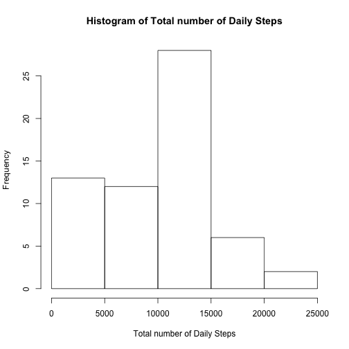
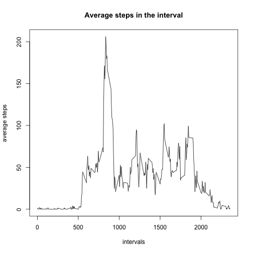
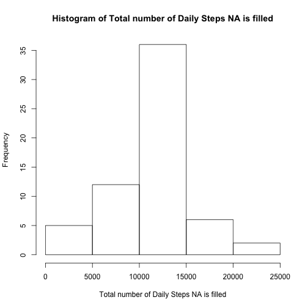
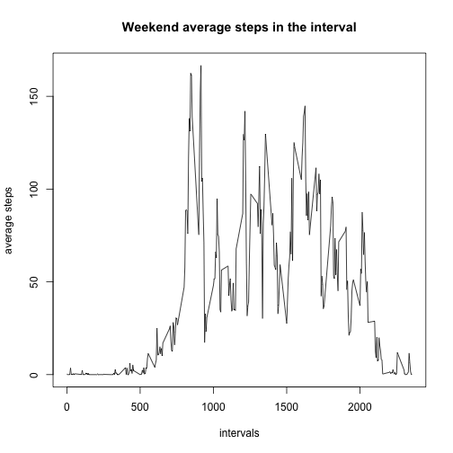
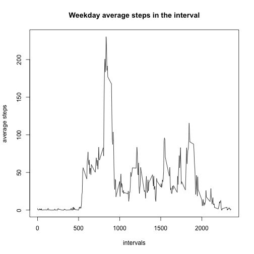

```r
        data <- read.csv("activity.csv", colClasses = c("numeric", "character","numeric"))
        arrayOfTotalDailySteps <- tapply(data$steps, data$date,sum, na.rm=TRUE)
        meanOfDailySteps <- mean(arrayOfTotalDailySteps, na.rm=TRUE)
        medianOfDailySteps <- median(arrayOfTotalDailySteps, na.rm=TRUE)
```

Find below histogram of Total number of daily steps

```r
hist(arrayOfTotalDailySteps, main="Histogram of Total number of Daily Steps", xlab="Total number of Daily Steps")
```

 


Mean of Daily Steps : 9354.2295082


Median of Daily Steps : 1.0395 &times; 10<sup>4</sup>


```r
avgDailyStepsInInterval <- tapply(data$steps,data$interval,mean,na.rm=TRUE)
intervals <- unique(data$interval)
plot(intervals,avgDailyStepsInInterval, type="l", main="Average steps in the interval", ylab="average steps")
```

 

```r
maxInterval <- NA
maxAvgDailyStepsInInterval = max(avgDailyStepsInInterval,na.rm=TRUE)
for (i in intervals) { 
        if (!is.na(avgDailyStepsInInterval[as.character(i)]) &
            avgDailyStepsInInterval[as.character(i)] == maxAvgDailyStepsInInterval){
                maxInterval <- i
        }
}
```
835 interval has maximum average number of steps


```r
lSteps <- is.na(data$steps)
numberOfRowsNA <- sum(lSteps)
```
Number of rows with NA values : 2304 

Lets fill the NA values with mean of the same intervals across the days. 


```r
noNAData <- data

for (i in 1:nrow(noNAData)) {
        if (is.na(noNAData$steps[i])) {
                noNAData$steps[i] <- avgDailyStepsInInterval[as.character(noNAData$interval[i])]
        }
}

arrayOfTotalDailyStepsNAF <- tapply(noNAData$steps, noNAData$date,sum)
        meanOfDailyStepsNAF <- mean(arrayOfTotalDailyStepsNAF)
        medianOfDailyStepsNAF <- median(arrayOfTotalDailyStepsNAF)
```

Find below histogram of Total number of daily steps when NA is filled

```r
hist(arrayOfTotalDailyStepsNAF, main="Histogram of Total number of Daily Steps NA is filled", xlab="Total number of Daily Steps NA is filled")
```

 


Mean of Daily Steps when NA is filled : 1.0766189 &times; 10<sup>4</sup>


Median of Daily Steps when NA is filled : 1.0766189 &times; 10<sup>4</sup>


We can observe that mean and median of the NA filled data set are different from the mean and median of the original data set with NA.


We also observe that mean and median of the NA filled data set are same.


By introducing values for NA, we observe that there is no change in mean but the median becomes same as mean.


```r
lweekend <- weekdays(as.Date(noNAData$date,"%Y-%m-%d")) == "Sunday" | weekdays(as.Date(noNAData$date,"%Y-%m-%d")) == "Saturday"
noNAData$weekend <- lweekend
weekDayData <- subset(noNAData,weekend==FALSE)
weekEndData <- subset(noNAData,weekend==TRUE)

avgDailyStepsInIntervalWeekday <- tapply(weekDayData$steps,weekDayData$interval,mean)
avgDailyStepsInIntervalWeekend <- tapply(weekEndData$steps,weekEndData$interval,mean)

plot(intervals,avgDailyStepsInIntervalWeekend, type="l",main="Weekend average steps in the interval", ylab="average steps")
```

 

```r
plot(intervals,avgDailyStepsInIntervalWeekday, type="l", main="Weekday average steps in the interval", ylab="average steps")
```

 


It can be observed that during the weekend activity is more at most of the intervals.
